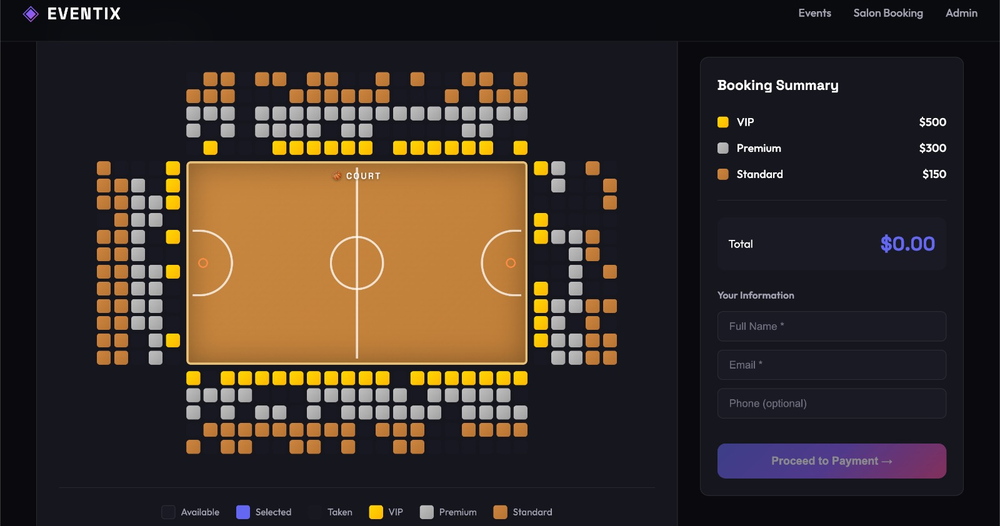
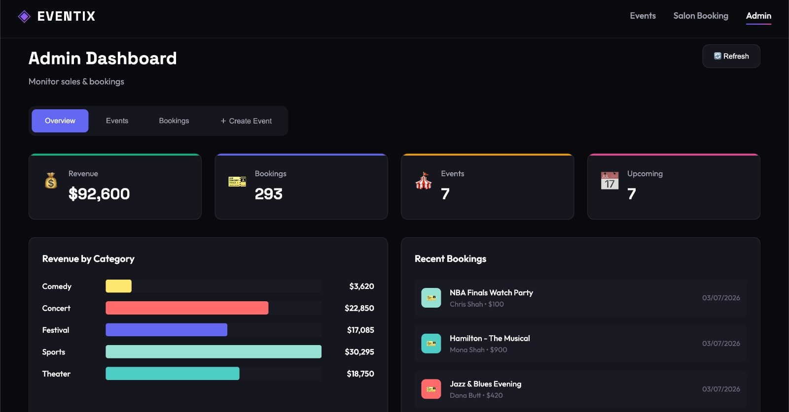

# 🎫 EVENTIX — Advanced Event Booking System

**Full-stack event booking system with interactive seat selection, real-time concurrency control, payment simulation, and QR ticket generation.**

[](https://event-booking-three-sandy.vercel.app)

[View Live Site](https://event-booking-three-sandy.vercel.app)

<!--
Desktop screenshots, 1440x900 (16:10), PNG, cropped to the app (no browser chrome).
-->

| | |
|---|---|
| **Interactive seat map** |  |
| **Admin analytics dashboard** |  |

## Overview

EVENTIX lets customers browse events, pick seats on a visual, tier-priced seat map, and check out — all protected against double-booking with real-time seat locking. It also includes stadium-scale ticketing and a full salon & spa appointment booking flow. Admins get an analytics dashboard covering revenue, occupancy, and booking activity, and can create new events directly from the dashboard.

## Features

### Customer

- Browse events — filter by category, search by name/venue/city
- Interactive seat selection with tier-based pricing (VIP, Premium, Standard)
- Stadium ticketing — book seats across VIP boxes, premium enclosure, and general stands at a full-scale venue
- Real-time seat locking that prevents double-booking, with automatic lock expiration
- Simulated secure checkout
- Digital QR tickets

### Salon & Spa

- Browse salon outlets and services (hair, skincare, nails, wellness)
- Pick an outlet, date, time slot, and chair, then book and pay
- Same real-time seat/slot locking to prevent double-booking
- QR appointment confirmation

### Admin

- Analytics dashboard — revenue tracking, booking statistics
- Create new events directly from the dashboard (venue, category, date, tiered pricing)
- Revenue by category, visualized
- Event performance — occupancy rates, tickets sold
- Live feed of recent bookings

## Technical architecture

**Backend (Node.js + Express)**

- Database: SQLite (via `sql.js`)
- Concurrency control: row-level seat locking with automatic expiration
- Race-condition handling: transaction-safe seat reservation
- Server-side QR code generation

**Database schema:** `venues`, `events`, `seats`, `seat_locks` (expire after 10 min), `bookings`, `booking_seats`, `payments`, plus the salon tables `salons`, `salon_outlets`, `salon_services`, `salon_seats`, `salon_seat_locks`, `salon_bookings`

## API endpoints

| Area | Endpoints |
|---|---|
| Events | `GET /api/events`, `GET /api/events/:id`, `GET /api/categories` |
| Seats | `GET /api/events/:id/seats`, `POST /api/events/:id/seats/lock`, `POST /api/events/:id/seats/release` |
| Bookings | `POST /api/bookings`, `GET /api/bookings/:id` |
| Payments | `POST /api/payments` (simulated) |
| Venues | `GET /api/venues` |
| Admin | `GET /api/admin/stats`, `GET /api/admin/bookings`, `POST /api/admin/events` |
| Salon | `GET /api/salons`, `GET /api/salons/:id`, `GET /api/salons/outlets/:id`, `GET /api/salons/outlets/:id/slots`, `GET /api/salons/outlets/:id/availability`, `POST /api/salons/outlets/:id/lock`, `POST /api/salons/outlets/:id/release`, `POST /api/salons/bookings`, `GET /api/salons/bookings/:id`, `POST /api/salons/payments` |

## Concurrency control

1. Session-based locking — each user gets a unique session
2. Timed locks — seats auto-release after 10 minutes
3. Conflict detection — real-time availability checking
4. Automatic cleanup — background job removes expired locks

## Project structure

```
event-booking/
├── backend/
│   ├── server.js          # Express API server
│   ├── database.js        # SQLite database layer + seed data
│   └── refresh-events.js  # Utility: refresh upcoming events + stadium venue
├── frontend/
│   └── build/
│       └── index.html     # Single-file React app (no build required)
└── package.json
```

## Getting started

```bash
git clone https://github.com/ShoaibRana888/event-booking.git && cd event-booking
npm install
npm start   # → http://localhost:3001
```

Sample data (venues, events, and a salon with outlets & services) is auto-seeded on first run. To refresh the catalog with a fresh slate of upcoming events and add the National Stadium venue, run:

```bash
node backend/refresh-events.js
```

## Contact

**Shoaib Rana** — [shoaib.rana888@gmail.com](mailto:shoaib.rana888@gmail.com) · [Portfolio](https://portfolio-pied-two-34.vercel.app/) · [GitHub](https://github.com/ShoaibRana888)
